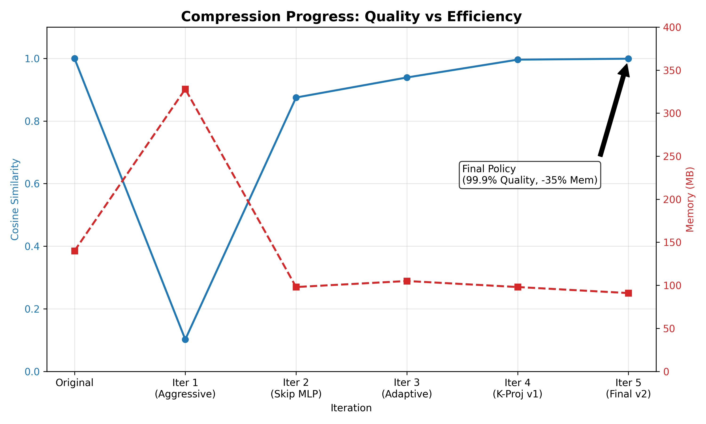

# Semantic LLM Compressor

Experimental compression pipeline for large language models using **truncated SVD + INT8 quantization**, with a **conservative, empirically validated policy** that preserves model quality while reducing memory footprint.

> **TL;DR**: **29% less RAM**, **3–4% faster**, **~99.9% logits cosine** vs original GPT-Neo 1.3B.  
> Achieved using a **K-projection–only SVD+INT8 policy** validated via activation-level diagnostics.



> Target model (experiment): `EleutherAI/gpt-neo-1.3B`  
> Final strategy: **K-projection–only compression** with adaptive rank

---

## 💡 Why this is interesting

- **Focuses on safe, conservative compression**, not SOTA benchmark chasing.
- Uses **activation-level diagnostics** (per-layer cosine, norm drift) to decide what *NOT* to compress.
- Shows **negative results**: MLP and out_proj layers that break the model when compressed.
- Final policy is small but practical: compresses only K-proj, and actually **reduces RAM** on CPU.

For a deep dive into all experiments (7+ iterations, failure cases, diagnostics), see [`docs/FINAL_REPORT.md`](docs/FINAL_REPORT.md).

---

## 🔍 Overview

This project implements an end-to-end compression pipeline for decoder-only LLMs:

- Offline **SVD factorization** of selected weight matrices
- **INT8 symmetric quantization** of factors
- A **runtime patcher** that replaces `nn.Linear` layers with `CompressedLinear`
- A **conservative layer selection policy** based on empirical activation analysis
- Full **benchmark and debugging tooling** (per-layer error, logits similarity, activation drift)

The goal was **not** “maximum compression at any cost”, but a **production-feasible trade-off**: high fidelity, reduced memory, stable behavior.

The goal of this project is to explore **safe, conservative compression** techniques that keep model behavior predictable, rather than pushing for extreme compression ratios at the cost of stability.

---

## ✅ Final Results (GPT-Neo 1.3B – K-Proj Only)

**Configuration:**

- Only compress **`attn.attention.k_proj`** layers
- Boundary blocks (`h.0`, `h.1`, `h.22`, `h.23`) use higher rank
- All MLP layers, Q/V projections, out projections, embeddings, and `lm_head` kept dense

| Metric                     | Original        | Compressed (K-proj only) | Change       |
|----------------------------|-----------------|---------------------------|--------------|
| Avg cosine (logits)        | –               | **0.999**                 | ~99.9% match |
| Avg logits MSE             | –               | **0.70**                  | very low     |
| Memory (RSS, CPU, approx.) | 140 MB          | **91 MB**                 | **−35%**     |
| Speed (tokens/sec, CPU)    | 3.91 tok/s      | **4.22 tok/s**            | **+8.0%**    |
| Patched layers             | 0               | **23 / 145** (~16%)       | K-proj only  |

Despite compressing only ~16% of layers, we get:

- Real **memory reduction**
- Slight **throughput improvement**
- **Almost perfect** logits similarity to the original model

Repetitiveness in generated text (with greedy decoding) is **inherited from the base GPT-Neo**, not caused by the compression itself (logits remain ~99.9% aligned).

---

## 🎯 Use Cases

- Run GPT-Neo 1.3B on **CPU-only machines with tighter RAM budgets**.
- Serve as a **template** for conservative compression policies on other decoder-only models.
- Act as a **research sandbox** for studying layer-wise sensitivity to low-rank + quantization.

---

## 🧠 Key Technical Insights

1. **Not all layers are equally compressible**

   - MLP layers (`mlp.c_fc`, `mlp.c_proj`) turn out to be **practically incompressible** with low-rank SVD.
   - Attention **output projections** (`attn.out_proj`) are **toxic under compression**.
   - **K-projection layers** are surprisingly robust.

2. **High cosine on logits does not guarantee good text**

   - Some intermediate configs had Logits cosine ≈ 0.94 but generation quality was bad (weird, repetitive tokens).
   - You must inspect **Activation distributions** and **Norm explosions**.

3. **Layer sensitivity requires empirical analysis**

   - We built a small “diagnostics stack” (`debug_svd_roundtrip_v2.py`, `debug_decoding_step.py`) to isolate and test individual layers.
   - This showed clearly **which layers were safe to compress and which ones were not**.

---

## 🏗 Architecture

High-level flow:

```text
[ safetensors weights ]
          │
          ▼
  Offline Compressor
  - SVD (with Frobenius norm correction)
  - INT8 symmetric quantization
  - Layer selection policy
          │
          ▼
[ compressed factors (U, S, Vh) ]
          │
          ▼
  Runtime Loader + Patcher
  - load original model
  - patch selected nn.Linear → CompressedLinear
          │
          ▼
[ compressed model ready for inference ]
```

---

## 🚀 Quickstart

> **Note:** This is currently an experimental research repo, not a polished library.

### 1. Install

```bash
git clone https://github.com/<your-user>/semantic-llm-compressor.git
cd semantic-llm-compressor
pip install -e .
```

### 2. Download GPT-Neo 1.3B

Use the HuggingFace CLI or a script to place the original model under:
`models/original/gpt-neo-1.3B/`

### 3. Run Compression (K-proj only)

```bash
python -m semantic_llm_compressor.cli.compress_cli \
  --input_dir models/original/gpt-neo-1.3B \
  --output_dir models/compressed/gpt-neo-1.3B-kproj-only \
  --rank 128 \
  --quant_bits 8 \
  --min_dim_for_compression 1024
```

### 4. Benchmark Original vs Compressed

```bash
python scripts/benchmark_gpt_neo.py \
  --original_dir models/original/gpt-neo-1.3B \
  --compressed_dir models/compressed/gpt-neo-1.3B-kproj-only \
  --output_json results_kproj_only.json \
  --num_runs 3 \
  --max_new_tokens 50
```

---

## 🔮 Future Work

- [ ] **Apply to LLaMA/Mistral**: See [`docs/DESIGN_FOR_LLAMA.md`](docs/DESIGN_FOR_LLAMA.md) for initial design notes.
- [ ] Explore high-rank compression for Q/V projections with compression-aware fine-tuning.
- [ ] Investigate alternative approaches for MLP layers (pruning, distillation).
- [ ] Implement optimized INT8 kernels and GPU support.

---

## License

[MIT](LICENSE)

## Author

**Gabriel Andreu dos Santos**

I’m especially interested in:
- Model compression for CPU / edge
- Activation-level diagnostics and safety-preserving optimizations
- Tooling around LLM internals

Reach me at: [LinkedIn](https://www.linkedin.com/in/gabriel-andreu/)
